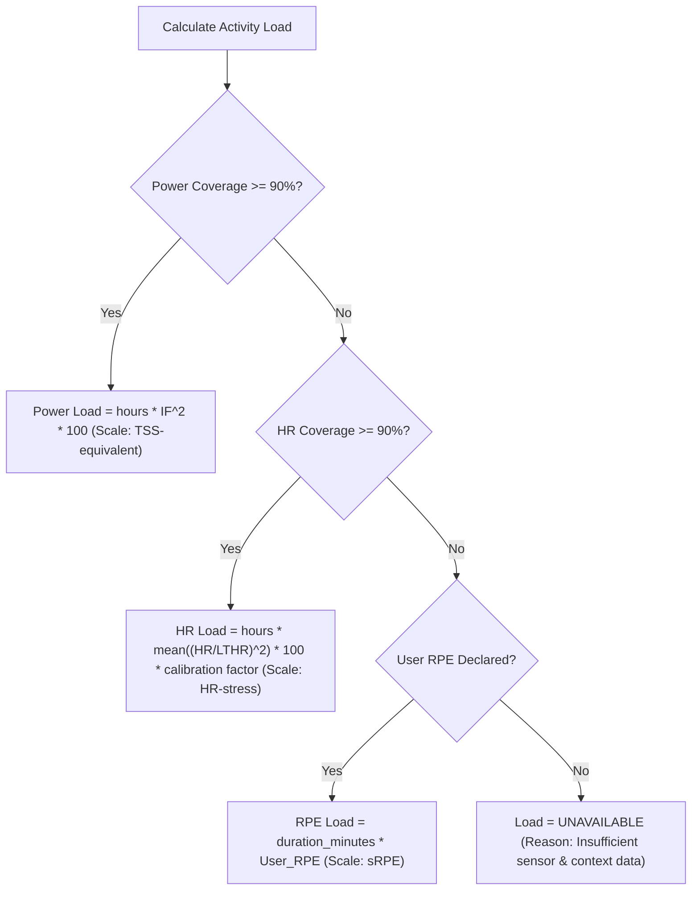

# Deterministic Analytics Specification

## Principles & Execution Model

1. **Deterministic & Reproducible:** All calculations are pure functions of normalized 1-second activity samples and explicit athlete parameter records. Given identical samples and parameters, analytics produce bit-for-bit identical outputs.
2. **Evidence Over Interpretation:** Missing or unrecorded sensor data returns an explicit `UNAVAILABLE` status with a cause code. Zero power is valid mechanical coasting; `null` power is missing sensor data. Missing data is never padded, interpolated across pauses, or replaced with fictional models.
3. **Algorithm Versioning:** The current algorithm specification is designated `mvp-1`.

---

## Power, Zones and Training Load

### 1. Work & Mean Power
- **Average Power ($P_{\text{avg}}$):** Mean of all active 1-second cells where power is non-null. Includes 0 Watt coasting seconds; excludes `null` cells.
  $$P_{\text{avg}} = \frac{\sum_{t \in \text{Active}, P_t \neq \text{null}} P_t}{N_{\text{valid\_power}}}$$
- **Total Work ($W_{\text{kJ}}$):** Mechanical work performed in kilojoules.
  $$W_{\text{kJ}} = \frac{\sum_{t \in \text{Active}, P_t \neq \text{null}} (P_t \cdot 1\,\text{s})}{1000}$$

### 2. Normalized Power ($NP$)
Normalized Power quantifies the physiological cost of power variation using a 30-second trailing rolling average fourth-power algorithm.

- **Window Rules:** Uses trailing complete **30-second contiguous active windows**. A 30-second window is invalid and discarded if it crosses a timer pause (`active = False`), crosses an uncovered gap ($>1\,\text{s}$ elapsed difference), or contains any `null` power cell.
- **Formula:** Let $P_{30, i}$ be the contiguous 30-second rolling average power for eligible window $i$:
  $$NP = \left( \frac{1}{M} \sum_{i=1}^{M} (P_{30, i})^4 \right)^{\frac{1}{4}}$$
  where $M$ is the count of eligible 30-second windows.
- **Edge Cases:** If $M < 1$ (activity duration $< 30\,\text{s}$ or zero valid 30-s windows), $NP$ is `UNAVAILABLE`.

### 3. Intensity Factor ($IF$)
Ratio of Normalized Power to athlete declared Functional Threshold Power ($FTP$).
$$IF = \frac{NP}{FTP}$$

### 4. Training Load (Multi-Tier Priority)
Training load is calculated using a strict single-source priority hierarchy: **Power Load > Heart Rate Load > Session RPE Load**. Source load types are NEVER combined or summed within an activity.

- **Tier 1: Power Load ($L_{\text{power}}$)**
  Requires $\ge 90\%$ power coverage during active seconds.
  $$L_{\text{power}} = \left( \frac{\text{Active Duration Seconds}}{3600} \right) \cdot IF^2 \cdot 100$$
- **Tier 2: Heart Rate Load ($L_{\text{hr}}$)**
  Used when power coverage $< 90\%$ and HR coverage $\ge 90\%$ (e.g., no-power MTB ride with HR monitor).
   $$L_{\text{hr}} = \left( \frac{\text{Active Duration Seconds}}{3600} \right) \cdot \text{mean}\left( \left( \frac{HR_t}{LTHR} \right)^2 \right) \cdot 100 \cdot k_{hr}$$
   where $k_{hr}$ is an optional empirical calibration factor derived from paired
   power and HR sessions. The current profile uses $k_{hr}=0.692$ from sessions
   dated 2026-09-04 onward. *Note:* $L_{\text{hr}}$ is an explicit relative HR
   stress score, not Banister TRIMP or HR-TSS.
- **Tier 3: Session RPE Load ($L_{\text{rpe}}$)**
  Used when both power and HR coverage $< 90\%$, provided user declared a session RPE ($0.0 - 10.0$).
  $$L_{\text{rpe}} = \text{Active Duration Minutes} \cdot \text{User RPE}$$

### 5. Chronic & Acute Training Load (CTL, ATL, TSB)
Daily load aggregation uses exponential rolling recursion over UTC calendar days:

$$CTL_d = CTL_{d-1} + \frac{L_d - CTL_{d-1}}{\tau_{\text{CTL}}} \quad (\tau_{\text{CTL}} = 42\,\text{days})$$
$$ATL_d = ATL_{d-1} + \frac{L_d - ATL_{d-1}}{\tau_{\text{ATL}}} \quad (\tau_{\text{ATL}} = 7\,\text{days})$$
$$TSB_d = CTL_{d-1} - ATL_{d-1}$$

- **Initialization & Warm-up:** Day 0 starts with $CTL_0 = 0, ATL_0 = 0$. Load queries spanning $< 42$ days output an explicit `WARMUP_INCOMPLETE` warning flag because initial zero states artificially depress early CTL values.
- **Rest Days:** Days without recorded activities are evaluated with $L_d = 0$.

### 6. Three-Zone Polarized Distribution
Rides are categorized into a 3-zone model based on Iñigo San Millán polarized principles using declared athlete parameter fractions:

| Zone | Power Boundary (Default: 80%, 100% FTP) | HR Boundary (Default: 87%, 100% LTHR) | Description |
|---|---|---|---|
| **Zone 1 (Low)** | $< 80\% \text{ FTP}$ | $< 87\% \text{ LTHR } (< 137\,\text{bpm})$ | Aerobic / Base / Zone 2 |
| **Zone 2 (Mid)** | $80\% - 100\% \text{ FTP}$ | $87\% - 100\% \text{ LTHR } (137-157\,\text{bpm})$ | Tempo / Sweet Spot / Threshold |
| **Zone 3 (High)**| $\ge 100\% \text{ FTP}$ | $\ge 100\% \text{ LTHR } (\ge 157\,\text{bpm})$ | High Intensity / Sub-threshold / VO2max |

Time spent in active cells is binned strictly into Zone 1 ($< b_1$), Zone 2 ($b_1 \le V < b_2$), or Zone 3 ($V \ge b_2$). Primary basis is power if active power exists, falling back to heart rate if no power is recorded.

---

## Aerobic Drift & Efficiency Factor (EF)

Aerobic Drift measures cardiac drift (loss of aerobic efficiency over time) during steady-state endurance efforts.

### 1. Stable Segment Finder
The algorithm scans active 1-second cells for candidate steady-state segments meeting ALL of the following criteria:
- **Duration:** Contiguous active duration $\ge 20$ minutes ($1200\,\text{s}$).
- **Intensity Gate:** Mean segment power between $50\%$ and $80\%$ of declared $FTP$.
- **Variability Gate:** Coefficient of Variation of power ($CV = \frac{\sigma_P}{\mu_P}$) $\le 15\%$.
- **Data Integrity:** Positive HR throughout, no timer pauses (`active = True`), and $100\%$ valid power and HR cells.

### 2. Efficiency & Drift Calculation
If a valid segment is identified, it is split into two equal chronological halves (Half 1 and Half 2):
$$\text{EF}_1 = \frac{\text{Mean Power}_{\text{Half 1}}}{\text{Mean HR}_{\text{Half 1}}}, \quad \text{EF}_2 = \frac{\text{Mean Power}_{\text{Half 2}}}{\text{Mean HR}_{\text{Half 2}}}$$
$$\text{Aerobic Drift \%} = 100 \cdot \left( \frac{\text{EF}_1 - \text{EF}_2}{\text{EF}_1} \right)$$

- **Interpretation:** Positive drift represents HR creep relative to power. If no candidate segment qualifies, drift status is returned as `UNAVAILABLE` with reason `NO_STABLE_SEGMENT_FOUND`.

---

## Durability (Observed Fatigue Resistance)

Durability measures an athlete's ability to maintain peak power outputs after incurring prior mechanical work (fatigue exposure).

### 1. Operational Definition & Prior Work Buckets
Durability compares peak contiguous mean power for requested durations (e.g., $5\,\text{s}, 1\,\text{min}, 5\,\text{min}$) across discrete cumulative work expenditure buckets:
- **Bucket 0:** $0 - 500\,\text{kJ}$ prior work.
- **Bucket 1:** $500 - 1000\,\text{kJ}$ prior work.
- **Bucket 2:** $1000 - 1500\,\text{kJ}$ prior work.
- **Bucket 3:** $> 1500\,\text{kJ}$ prior work.

### 2. Strict Qualification & Window Rules
- **Overall Coverage Gate:** Activity MUST have $\ge 95\%$ valid power coverage across total active time.
- **Cell Strictness Gate:** Every single active cell inside a candidate duration window MUST contain a non-null power value AND have zero unexplained elapsed time gaps.
- **Bucket Placement Rule:** A duration window belongs to Bucket $k$ **ONLY IF ALL SECONDS** within that window occur while cumulative mechanical work $W(t)$ is strictly within the energy range $[W_{\text{start}, k}, W_{\text{end}, k})$. If a window crosses a bucket boundary, it is excluded from both buckets.

### 3. Durability Metrics
For each duration $d$ and bucket $k$:
$$\text{Durability \%}_{d, k} = 100 \cdot \left( \frac{\text{Best Power}_{d, k}}{\text{Best Power}_{d, \text{Bucket 0}}} \right)$$

### 4. No-Power MTB & Missing Sensor Handling (CRITICAL)
- **No-Power MTB Activities:** For rides lacking power data (e.g., MTB rides with only HR/speed), durability is **EXPLICITLY UNAVAILABLE**.
- **No Derived Proxies:** The system MUST NOT synthesize fictional power, fake kJ work buckets, or substitute HR durability proxies. If power is absent, durability returns:
  `{"status": "UNAVAILABLE", "reason": "MISSING_POWER_SENSOR"}`.

---

## Threshold Estimation (Observed Peak Effort)

- **Observed Peak FTP Estimate:** Calculated as $95\%$ of the maximum contiguous 20-minute average power observed in an activity.
  $$\text{FTP}_{\text{estimated}} = 0.95 \cdot \max(P_{20\text{min}})$$
- **Contract & Governance:**
  - Tagged as `LOW_CONFIDENCE_OBSERVED_EFFORT`.
  - Returned strictly as an informational metric.
  - **NEVER** mutates or overwrites the athlete's declared parameters in `parameters.duckdb`. Parameter updates remain exclusively explicit user actions.
