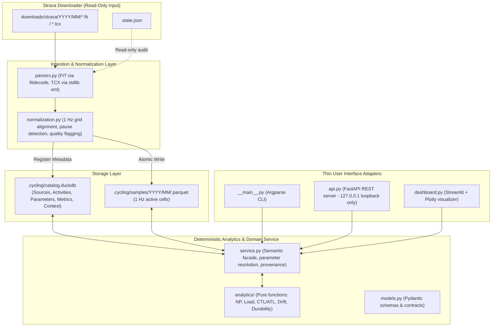

# System Architecture

## Overview

This document specifies the software architecture for local-first cycling analytics built on top of an existing Strava downloader repository. The system processes raw FIT and TCX files downloaded from Strava into an immutable, file-based analytical database using DuckDB for metadata cataloging and Apache Parquet for time-series record storage.

The architecture is designed as a single-athlete, local-first system. It isolates data ingestion from analytical execution, guaranteeing deterministic metrics, strict data quality tracking, and absolute isolation from external network dependencies or modifying downloader state.



---

## Downloader Integration & Repository Facts

The underlying repository functions primarily as an automated Strava browser downloader using Playwright. The analytics layer treats all downloader artifacts strictly as immutable read-only inputs.

### Data Inventory Facts
- **Source Files:** 159 real binary files on disk across `downloads/strava/YYYY/MM/`:
  - 152 `.fit` binary files (Flexible and Interoperable Data Transfer protocol).
  - 7 `.tcx` XML files (Training Center XML schema).
- **Date Range:** January 2026 through September 2026.
- **File Naming Convention:** `downloads/strava/YYYY/MM/YYYY-MM-DD_<sanitized-title>_<strava-id>.<fit|tcx>`
- **Downloader State File (`.state.json`):** Contains 163 recorded state entries:
  - 159 successfully downloaded files matching disk contents.
  - 1 failed download record.
  - 3 missing file references (deleted or failed upstream).
- **Python Version Constraint:** Project targets Python `>=3.13,<3.14`.
- **Parser Dependencies:** The base downloader has no parsing dependencies. The analytics component adds `fitdecode` for FIT binary parsing and uses Python standard library `xml.etree.ElementTree` for TCX XML parsing (safeguarded against entity expansion).

---

## Layered Architecture & Component Boundaries

The system is strictly separated into core logic and thin presentation adapters.

| Boundary Component | Location | Responsibility & Rules |
|---|---|---|
| **Parsers** | `cycling/parsers.py` | Low-level decoding of FIT binary streams and TCX XML documents into raw timestamped sensor records. Rejects invalid DTDs. Preserves null values. |
| **Normalization** | `cycling/normalization.py` | Maps raw records to contiguous 1-second UTC time cells. Detects timer pauses and sensor gaps, applies short forward-fills (≤5 s), computes coverage, and sets quality flags. |
| **Storage Engine** | `cycling/storage.py`, `ingestion.py` | Manages the DuckDB catalog, SHA-256 deduplication, atomic Parquet file publication, parameter versioning, and metric snapshot storage. |
| **Analytics Engine** | `cycling/analytics/` | Pure, deterministic mathematical functions (NP, IF, Load, Power Curve, Aerobic Drift, Durability, CTL/ATL/TSB). Completely free of side effects, I/O, database access, or network calls. |
| **Semantic Service** | `cycling/service.py`, `models.py` | Business logic facade (`CyclingService`). Validates request contracts via Pydantic, resolves parameter versions, interacts with storage, invokes analytics, and returns `ToolResult` response envelopes with algorithm provenance. |
| **User Adapters** | `cycling/__main__.py`, `api.py`, `dashboard.py` | Thin adapters for CLI (`argparse`), FastAPI HTTP endpoints, and Streamlit dashboard. Adapters MUST NOT re-implement analytical formulas or access storage directly; all operations delegate to `CyclingService`. |

---

## Storage Architecture: DuckDB + Parquet

The storage engine separates high-volume time-series samples from relational metadata.

### Data Layout on Disk
```text
.cycling/
├── catalog.duckdb                                    # Relational metadata, sources, parameters, metrics
└── samples/
    └── YYYY/
        └── MM/
            └── <sha256>.parquet                      # 1 Hz normalized activity time-series
```

1. **Relational Catalog (`catalog.duckdb`):** Stores source file inventory, activity metadata, immutable versioned athlete parameters, user-declared context overrides (RPE, manual modality), and precomputed metric snapshots.
2. **Time-Series Storage (`.parquet`):** Formatted per-activity in a partitioned `YYYY/MM/` directory structure. Columns use strongly-typed PyArrow/Parquet data types with zstd compression. Null values represent unrecorded or missing sensor data (never padded with zeros).

---

## Durability, Atomic Publication & Recovery

To prevent catalog corruption or orphaned files during processing failures:

1. **SHA-256 Hashing:** Prior to ingestion, every raw source file is hashed via SHA-256. The hash serves as the immutable activity identifier (`activity_id`). Duplicate files with identical content hashes map to a single catalog entry regardless of path or filename.
2. **Atomic Parquet Writes:** Normalization writes to a temporary file `.cycling/samples/YYYY/MM/<sha256>.parquet.tmp`. Only upon successful completion and `fsync` is the file atomically moved to its destination `.cycling/samples/YYYY/MM/<sha256>.parquet` before committing the metadata transaction to DuckDB.
3. **Crash Recovery & Re-ingestion:** If a crash occurs during Parquet writing, the temporary file is ignored or cleaned up on next startup. A catalog entry is never created for a partially written Parquet file. Re-running ingestion scans `.state.json` and disk files, reconciling missing entries idempotently.
4. **Single-Writer Lock Safety:** DuckDB operates in single-writer mode. To avoid database lock contention (`IO Error: Could not set lock on file`), batch CLI ingestion/reprocessing tasks should run when the API or Streamlit dashboard is stopped, or access DuckDB via read-only connections where supported.

---

## Security & Network Isolation

- **Zero Cloud Dependencies:** The analysis engine makes zero outgoing network calls, telemetry submissions, or remote API queries.
- **Local HTTP Binding:** The FastAPI server (`api.py`) binds exclusively to loopback `127.0.0.1`. It MUST NOT bind to `0.0.0.0` to protect private GPS and biometrics.
- **XML Parsing Safeguards:** TCX parser explicitly disables DTD loading and entity expansion to prevent XXE (XML External Entity) attacks.

---

## System Assumptions, Open Decisions & Risks

### System Assumptions
1. **Timestamp Authority:** Embedded UTC timestamps within FIT/TCX files are authoritative over file names or file creation dates.
2. **Modality Handling:** If sport/subsport headers are missing or ambiguous, modality remains `unknown`. Modality is never inferred from sensor presence (e.g., absence of power does not imply Mountain Biking).
3. **UTC Aggregation:** Daily training load (CTL/ATL/TSB) and calendar distribution use UTC calendar days in MVP; local timezone offset handling is deferred.

### Open Architecture Decisions
1. **Multi-device Duplicate Handling:** If two different files exist for the same activity (e.g., FIT from head unit and TCX from Strava export with different hashes), they are currently ingested as distinct activities. Multi-device de-duplication via start-time matching is deferred to post-MVP.

### Technical Risks & Mitigations
- **DuckDB File Lock Conflicts:** Concurrent CLI writes while Streamlit is open could lock `catalog.duckdb`. *Mitigation:* Implement short retry backoffs and document single-writer operational patterns.
- **Large Memory Spikes on High-Frequency FIT Streams:** 10 Hz recording FIT files could consume excessive memory during parsing. *Mitigation:* Stream binary records directly into 1 Hz accumulator cells before Parquet materialization.
