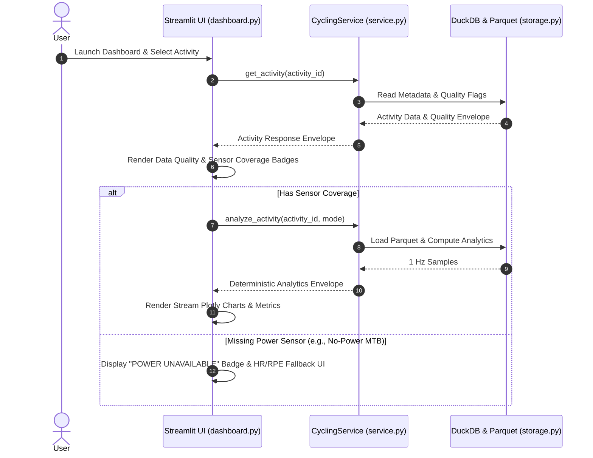

# Streamlit & Plotly Dashboard Specification

## Design Philosophy: Evidence Before Interpretation

The dashboard provides a single-athlete analytical interface driven by Streamlit and Plotly. It enforces an **evidence-first** user UX paradigm: raw data quality, missing sensor indicators, and algorithm provenance are explicitly displayed alongside all charts and metrics.

### Core UI Principles
1. **Zero Direct Database Operations:** The dashboard consumes data exclusively through `CyclingService` facade method calls. It never executes SQL directly or computes independent formulas.
2. **Display-Only Downsampling:** Stream sampling for interactive charts downsamples high-density 1 Hz points (e.g., LTTB or min-max sampling to $\le 2000$ points) solely for browser rendering performance. All underlying analytics use full-resolution 1 Hz Parquet samples.
3. **No Silent Defaults:** Unrecorded sensors (such as missing power on an MTB ride) trigger explicit visual badges and explainers rather than rendering empty or zero-padded plots.

---

## Read Path & Interaction Flow



---

## UI Views & ASCII Wireframes

### View 1: Activity Deep Dive View
Visualizes 1 Hz time-series streams, quality metrics, zones, and steady-state aerobic drift.

```text
+-----------------------------------------------------------------------------------+
| ACTIVITY: 2026-04-12 "XCM Race Round 1" (ID: 9f8e7d6c...)                         |
| Modality: MTB | Date: 2026-04-12 | Parameter Basis: param-2026-01-01 (Historical)  |
+-----------------------------------------------------------------------------------+
| SENSOR QUALITY BADGES:                                                            |
| [Power: 98.5% OK] [HR: 99.2% OK] [Cadence: 95.0% OK] [Quality: NO_FLAGS]          |
+-----------------------------------------------------------------------------------+
| KEY METRICS:                                                                      |
| Duration: 01:25:20 | Work: 1,205 kJ | Avg Power: 235 W | NP: 262 W | IF: 0.92      |
| Training Load: 120.4 (Power TSS) | Aerobic Drift: +2.4% (Stable Segment 24 min)   |
+-----------------------------------------------------------------------------------+
| TIME SERIES STREAMS (Plotly):                                                    |
| 300 W +----------------------------------------+ (Power - Orange)                 |
|       |   /\    /\/\    /\                     |                                  |
| 160 bpm +--------------------------------------+ (HR - Red)                       |
|       |  /  \__/    \__/  \                    |                                  |
|       +----------------------------------------+                                  |
|       00:00        00:30        01:00      01:25                                  |
+-----------------------------------------------------------------------------------+
| POWER & HR ZONE DISTRIBUTION:                                                    |
| Zone 1 (Low):   [===========================>         ] 55%                       |
| Zone 2 (Mid):   [=================>                   ] 35%                       |
| Zone 3 (High):  [====>                                ] 10%                       |
+-----------------------------------------------------------------------------------+
```

### View 2: Durability & Fatigue Resistance View
Plots peak observed power outputs across cumulative work buckets ($0-500\,\text{kJ}, 500-1000\,\text{kJ}, \dots$).

```text
+-----------------------------------------------------------------------------------+
| DURABILITY ANALYTICS: 2026-04-12 "XCM Race Round 1"                              |
+-----------------------------------------------------------------------------------+
| BUCKET EXPOSURE:                                                                  |
| Bucket 0 (0-500 kJ):    500 kJ accumulated | 1,800 s active                        |
| Bucket 1 (500-1000 kJ): 500 kJ accumulated | 1,950 s active                        |
| Bucket 2 (1000+ kJ):    205 kJ accumulated |   850 s active                        |
+-----------------------------------------------------------------------------------+
| PEAK POWER DECAY BY PRIOR WORK (Plotly):                                          |
| Watts                                                                             |
| 800 | * (Bucket 0: Fresh)                                                         |
| 600 |    o (Bucket 1: 500-1000 kJ)                                                |
| 400 |       x (Bucket 2: 1000+ kJ)                                                |
|     +--------------------------------------------------                           |
|     5s         30s        1m        5m       20m   (Duration)                     |
+-----------------------------------------------------------------------------------+
| NO-POWER MTB NOTICE (Condition-Gated Rendering):                                 |
| If activity has missing power:                                                    |
| [!] DURABILITY UNAVAILABLE: No power sensor data recorded for this ride.          |
|     System rules prohibit generating fictional power or fake HR durability.      |
+-----------------------------------------------------------------------------------+
```

### View 3: Training Load & Polarized Distribution View
Displays global long-term CTL/ATL/TSB trends, plus the same load summary split by modality.

```text
+-----------------------------------------------------------------------------------+
| ATHLETE TRAINING LOAD & POLARIZED DISTRIBUTION                                    |
| Date Range: 2026-01-01 to 2026-09-13 | Mode: Historical Parameters                |
+-----------------------------------------------------------------------------------+
| Global CTL (Fitness): 68.4 | ATL (Fatigue): 82.1 | TSB (Form): -13.7 (Building Load) |
+-----------------------------------------------------------------------------------+
| LONG-TERM FITNESS TRAJECTORY (Plotly):                                            |
| Load                                                                              |
| 100 |                             /---\ CTL (Blue solid)                          |
|  50 |                            /     \ ATL (Red dashed)                         |
|   0 +--------------------------/--------\----------------                         |
| -20 | TSB (Green area fill)   /          \                                        |
|     Jan 2026                 Apr 2026   Sep 2026                                  |
+-----------------------------------------------------------------------------------+
 | 3-ZONE VOLUME DISTRIBUTION:                                                      |
 | Total Hours: 142.5 hrs | Modality: All (global)                                  |
| Z1 (Base):  [=========================================       ] 78.5% (Target ~80%)  |
| Z2 (Tempo): [========                                        ] 14.2%              |
| Z3 (HIIT):  [====                                            ]  7.3% (Target ~20%)  |
+-----------------------------------------------------------------------------------+
```

The global load view combines indoor trainer and outdoor activities before calculating
the daily series. CTL is a 42-day exponentially weighted average of daily load and
approximates fitness; ATL uses 7 days and approximates recent fatigue; TSB is the
previous day's CTL minus ATL and approximates freshness. Daily load selects power,
then HR, then session RPE according to available sensor coverage. The dashboard also
shows modality-specific summaries for comparison.

---

## Precomputation & Query Optimization

To maintain sub-second UI rendering latency over months of activity records:

1. **Precomputed Metrics Catalog:** During ingestion or reprocessing, the `metrics` table stores full JSON analytic snapshots for each activity. UI overview views query the precomputed DuckDB JSON fields directly:
   ```sql
   SELECT
       activity_id,
       start_time_utc,
       modality,
       json_extract_string(metric_data, '$.summary.normalized_power_w') AS np,
       json_extract_string(metric_data, '$.metrics.training_load.value') AS load
   FROM metrics
   WHERE parameter_selection_mode = 'historical'
   ORDER BY start_time_utc DESC;
   ```
2. **On-Demand Time-Series Sampling:** Detailed stream plots read Parquet sample files on demand using PyArrow memory mapping and LTTB (Largest Triangle Three Buckets) downsampling to 1,500 points for browser rendering.

---

## Robust Error & Edge-Case UI Handling

- **Empty Database Catalog:** Displays a user-friendly guidance card: `"No ingested activities found in .cycling/catalog.duckdb. Run 'cycling ingest' from your terminal to scan source files."`
- **Failed Ingestion Records:** Sources flagged as `failed` in DuckDB display an actionable error accordion listing the filename, timestamp, and failure stack/reason without crashing Streamlit.
- **No-Power MTB Rides:** Power-dependent UI elements (Power Curve, Durability, IF, NP, Power Zones) render clear `UNAVAILABLE` notice boxes, automatically enabling HR-Load or RPE-Load visualization options.
