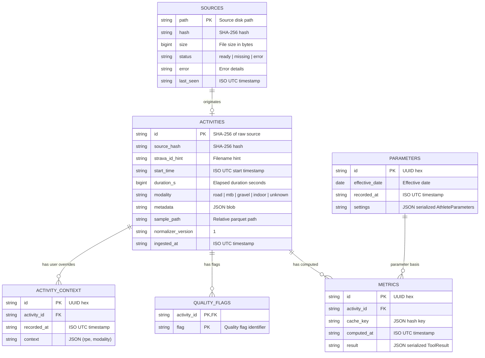

# Data Model & Storage Schema

## Overview

The data model separates metadata management from high-density sensor time-series. DuckDB manages relational entities, audit logs, athlete parameter histories, and precomputed metric snapshots. Apache Parquet files store 1-second normalized sensor time-series per activity under `.cycling/samples/YYYY/MM/<sha256>.parquet`.

---

## Entity-Relationship Diagram



---

## Catalog Physical & Logical Schema (DuckDB)

### 1. Table: `sources`
Tracks physical source files discovered in source directory (e.g. `downloads/strava/`) and reconciles disk inventory.

```sql
CREATE TABLE sources (
    path        VARCHAR PRIMARY KEY, -- Source file path
    hash        VARCHAR,             -- SHA-256 hash digest
    size        BIGINT,              -- File size in bytes
    status      VARCHAR,             -- 'ready', 'missing', 'error'
    error       VARCHAR,             -- Details if ingestion/parsing failed
    last_seen   VARCHAR              -- ISO UTC timestamp
);
```

### 2. Table: `activities`
Primary activity metadata extracted during normalization.

```sql
CREATE TABLE activities (
    id                 VARCHAR PRIMARY KEY, -- SHA-256 hash of raw file content
    source_hash        VARCHAR,             -- Content hash (matches id)
    strava_id_hint     VARCHAR,             -- Extracted Strava ID from filename
    start_time         VARCHAR,             -- ISO UTC start timestamp
    duration_s         BIGINT,              -- Total elapsed duration in seconds
    modality           VARCHAR,             -- road, mtb, gravel, indoor, unknown
    metadata           VARCHAR,             -- Complete JSON metadata dictionary
    sample_path        VARCHAR,             -- Relative path to normalized Parquet file
    normalizer_version VARCHAR,             -- Normalizer algorithm version ('1')
    ingested_at        VARCHAR              -- ISO UTC timestamp of ingestion
);
```

### 3. Table: `parameters`
Immutable, append-only historical log of athlete physiological parameters.

```sql
CREATE TABLE parameters (
    id              VARCHAR PRIMARY KEY, -- UUID hex
    effective_date  DATE,                -- Date from which parameters take effect
    recorded_at     VARCHAR,             -- ISO UTC timestamp when record was created
    settings        VARCHAR              -- JSON serialized AthleteParameters contract
);
```

#### Athlete Parameters Contract (`AthleteParameters` JSON Structure):
- `effective_date`: Date string (default `2026-01-01`)
- `ftp_w`: Float (default `285.0`)
- `lthr_bpm`: Float (default `157.0`)
- `max_hr_bpm`: Float (default `181.0`)
- `weight_kg`: Float (default `75.0`)
- `power_zone_fractions`: List of Floats (default `[0.55, 0.75, 0.90, 1.05, 1.20]`)
- `hr_zone_bounds`: List of Floats (default `[127.0, 141.0, 147.0, 158.0]`)
- `power_three_zone_fractions`: List of Floats (default `[0.80, 1.0]`)
- `hr_three_zone_fractions`: List of Floats (default `[0.87, 1.0]`)
- `ctl_days`: Float (default `42.0`)
- `atl_days`: Float (default `7.0`)
- `notes`: String (default `"Profile defaults; declared, not measured historical thresholds"`)

#### Parameter Selection Logic
- **Historical Mode (Default):** Selects parameter record where `effective_date <= activity.start_time`, ordered by `effective_date DESC, recorded_at DESC, id DESC LIMIT 1`. Fallback if no prior record exists: earliest parameter record (`effective_date ASC, recorded_at ASC, id ASC LIMIT 1`).
- **Current Mode:** Selects latest parameter record where `effective_date <= TODAY`, ordered by `effective_date DESC, recorded_at DESC, id DESC LIMIT 1`.

### 4. Table: `metrics`
Snapshot store of precomputed analytics per activity, cache key, and algorithm version.

```sql
CREATE TABLE metrics (
    id           VARCHAR PRIMARY KEY, -- UUID hex
    activity_id  VARCHAR,             -- Activity SHA-256 ID
    cache_key    VARCHAR,             -- JSON hash key encoding version, params, rpe
    computed_at  VARCHAR,             -- ISO UTC timestamp
    result       VARCHAR              -- Serialized ToolResult JSON string
);
```

### 5. Table: `activity_context`
Append-only store for user-declared context overrides (e.g. subjective RPE, explicit modality correction).

```sql
CREATE TABLE activity_context (
    id           VARCHAR PRIMARY KEY, -- UUID hex
    activity_id  VARCHAR,             -- Activity SHA-256 ID
    recorded_at  VARCHAR,             -- ISO UTC timestamp
    context      VARCHAR              -- JSON encoded dict with rpe and/or modality
);
```

### 6. Supporting Tables in `catalog.duckdb`
- `quality_flags`: (`activity_id VARCHAR`, `flag VARCHAR`, `PRIMARY KEY (activity_id, flag)`)
- `intervals`: (`id VARCHAR PRIMARY KEY`, `activity_id VARCHAR`, `interval_type VARCHAR`, `start_s INT`, `end_s INT`, `metrics VARCHAR`)
- `power_curve`: (`activity_id VARCHAR`, `duration_s INT`, `max_power_w DOUBLE`, `PRIMARY KEY (activity_id, duration_s)`)
- `daily_training_load`: (`date DATE PRIMARY KEY`, `ctl DOUBLE`, `atl DOUBLE`, `tsb DOUBLE`, `total_load DOUBLE`)
- `processing_runs`: (`id VARCHAR PRIMARY KEY`, `run_at VARCHAR`, `status VARCHAR`, `summary VARCHAR`)
- `acquisition_audits`: (`root VARCHAR PRIMARY KEY`, `audited_at VARCHAR`, `summary VARCHAR`)

---

## Normalized Samples Schema (Parquet)

Every normalized activity is saved as a single Parquet file under `.cycling/samples/YYYY/MM/<sha256>.parquet`. Time series are aligned to a strict 1-second grid (`elapsed_s = 0, 1, 2, ...`).

| Column Name | PyArrow Type | Nullable? | Units / Description |
|---|---|---|---|
| `timestamp` | `pa.timestamp("us", tz="UTC")` | No | Absolute 1-second cell UTC timestamp |
| `elapsed_s` | `pa.int64()` | No | Wall-clock elapsed seconds since activity start (0-indexed) |
| `segment` | `pa.int64()` | No | Contiguous active segment index (increments after pause/gap) |
| `active` | `pa.bool_()` | No | `True` if timer was running and cell is active; `False` if paused |
| `power_w` | `pa.float64()` | **Yes** | Instantaneous power in Watts. **Null when missing/unrecorded** |
| `hr_bpm` | `pa.float64()` | **Yes** | Heart rate in Beats Per Minute. Null when missing |
| `cadence_rpm`| `pa.float64()` | **Yes** | Crank cadence in Revolutions Per Minute. Null when missing |
| `speed_mps` | `pa.float64()` | **Yes** | Speed in Meters Per Second. Null when missing |
| `distance_m` | `pa.float64()` | **Yes** | Cumulative distance in Meters |
| `altitude_m` | `pa.float64()` | **Yes** | Barometric or GPS altitude in Meters above sea level |
| `latitude` | `pa.float64()` | **Yes** | WGS84 Latitude in decimal degrees |
| `longitude` | `pa.float64()` | **Yes** | WGS84 Longitude in decimal degrees |

---

## Quality Flags and Coverage Tracking

During normalization, quality flags are evaluated and stored in DuckDB and activity metadata:

1. **Sensor Coverage Metrics:**
   $$\text{Coverage}_{\text{sensor}} = \frac{\text{Count of non-null sensor samples during active cells}}{\text{Total active duration seconds}}$$
2. **Quality Flag Taxonomy:**
   - `missing_power`: Activity contains 0 non-null power samples (e.g., no-power MTB ride).
   - `missing_hr`: Activity contains 0 non-null heart rate samples.
   - `high_data_gaps`: Uncovered timer gaps (>5 s) exceed 5% of total elapsed time.
   - `duplicate_timestamps`: Raw source contained duplicate timestamp records merged during ingestion.
   - `reordered_timestamps`: Raw source timestamps arrived out of chronological order.
   - `invalid_sensor_values`: Sensor readings fell outside physically plausible bounds and were converted to nulls.
   - `ambiguous_modality`: Sport/subsport metadata was missing or unrecognized; defaulted to `unknown`.
