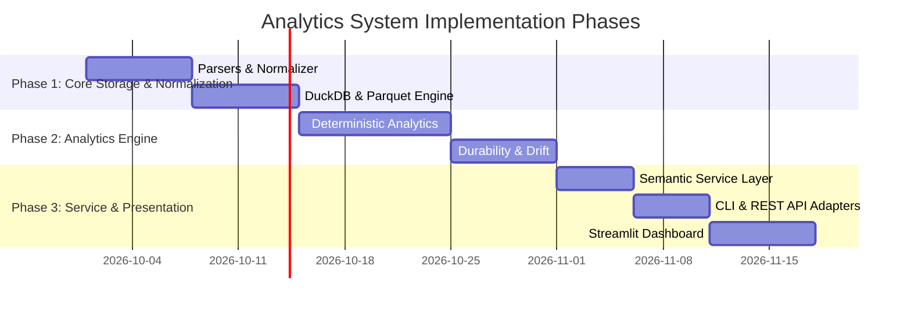

# Implementation & Verification Plan

## Overview

This document defines the roadmap, technical dependencies, milestone acceptance criteria, and risk mitigations for the local-first cycling analytics application.

---

## Technical Stack & Dependencies

The project targets Python `>=3.13,<3.14`. Existing Playwright downloader components remain untouched.

| Component | Library / Tool | Justification & Purpose |
|---|---|---|
| **FIT Decoder** | `fitdecode` | High-performance decoding of binary `.fit` records into Python data structures and lap summaries. |
| **TCX Decoder** | `xml.etree.ElementTree` (Stdlib) | Lightweight XML parsing for `.tcx` files with entity expansion disabled and lap trackpoint extraction. |
| **Relational Catalog** | `duckdb` | Fast, local, file-based analytical database for activity metadata, `activity_laps` evidence, parameters, and cached metric snapshots. |
| **Time-Series Storage** | `pyarrow` | Efficient reading and writing of 1 Hz normalized activity Parquet files. |
| **Data Validation** | `pydantic` | Contract definitions, request/response payload schemas (`ToolResult`), and bound checks. |
| **REST API Server** | `fastapi`, `uvicorn` | Asynchronous local HTTP web server bound strictly to loopback (`127.0.0.1`). |
| **Interactive Dashboard** | `streamlit`, `plotly` | Local web user interface and interactive web-based data visualization. |
| **Code Quality** | `ruff`, `mypy`, `pytest` | Formatting, static type analysis, and deterministic unit testing. |

---

## Implementation Milestones & Acceptance Criteria

### Milestone 1: Data Ingestion & Normalization Engine
- **Focus:** FIT/TCX parsing, 1 Hz grid alignment, pause/gap detection, `activity_laps` schema, and DuckDB/Parquet storage integration.
- **Acceptance Criteria:**
  1. Ingestion CLI command `python -m cycling ingest` (with optional `--new-only` default flag or `--force` reparse) successfully processes all original files in `downloads/strava/`.
  2. Inventory audit correctly identifies `.state.json` records, cataloging failed and missing files without throwing unhandled exceptions.
  3. SHA-256 deduplication guarantees running ingestion a second time results in 0 duplicate catalog records or Parquet overwrites.
  4. Device-recorded lap summaries are stored in the DuckDB `activity_laps` catalog table preserving lap index, start time, duration, distance, work, power, HR, and cadence.
  5. Normalized Parquet files adhere strictly to the 1 Hz schema (`elapsed_s = 0, 1, 2, ...`) with explicit `null` representation for unrecorded sensors.

### Milestone 2: Deterministic Analytics Module
- **Focus:** Pure mathematical functions in `cycling/analytics/` (NP, IF, Multi-tier Load, CTL/ATL, Drift, Durability, Single-Activity & Period Power Curves, 3-zone Polarized).
- **Acceptance Criteria:**
  1. Unit tests verify bit-for-bit identical outputs for known synthetic test vectors.
  2. 30-second rolling NP calculation correctly invalidates windows crossing timer pauses or gaps $> 1\,\text{s}$.
  3. Power curve calculation evaluates best observed Mean Maximal Power (MMP) across durations for single activities (`power_curve`) as well as period aggregates (`period_power_curve`).
  4. Training load hierarchy accurately applies Power Load ($\ge 90\%$ coverage), HR Load fallback ($\ge 90\%$ coverage), and sRPE fallback.
  5. Durability evaluation enforces $\ge 95\%$ power coverage, cell-level non-null strictness, and continuous 1-second step samples without unexplained elapsed gaps.
  6. **No-Power MTB Test:** Durability on no-power rides returns `available: false` with reason explaining missing power coverage, creating zero fake watts or synthetic HR durability proxies.

### Milestone 3: Semantic Service & Parameter Provenance
- **Focus:** `CyclingService` facade, parameter versioning, cached metrics, and Pydantic contract validation.
- **Acceptance Criteria:**
  1. Historical parameter resolution selects the effective parameter set non-later than activity start timestamp; current mode selects effective settings today.
  2. Parameter edits append immutable records to `parameters`; existing metric snapshots remain unchanged unless `cycling reprocess` (supporting `--metric`, `--from`, `--all`, and `--parameter-mode`) is explicitly invoked.
  3. Input bounds enforcement rejects invalid inputs (e.g., negative duration, RPE $> 10.0$, invalid hex IDs).
  4. All service operations return uniform `ToolResult` envelopes with operation name, algorithm version, parameter selection provenance, computation timestamp, and data.

### Milestone 4: Presentation Adapters (CLI, API, Dashboard)
- **Focus:** Standard `argparse` CLI commands, FastAPI endpoints, and Streamlit/Plotly dashboard views.
- **Acceptance Criteria:**
  1. CLI commands provide rich filtering options: `activities list` supports `--limit` and `--modality`; `power-curve` supports single activity ID or period mode (`--period`, `--modality`, `--end-date`) with `power-curves` CLI alias; `reprocess` supports `--metric`, `--from`, and `--all`.
  2. FastAPI server binds exclusively to `127.0.0.1`, exposing `GET /health`, `GET /status`, `GET /activities`, `POST /power-curve`, `POST /power-curves`, `POST /durability`, `POST /load`, etc., passing OpenAPI validation.
  3. Streamlit dashboard renders 7 views: Overview (status, recent activities, load summary), Progress (longitudinal power, efficiency, durability, drift, composition, fatigued-PDC, and threshold evidence), Activity (metrics JSON, interactive stream chart, threshold estimate), Power curve (period and single activity log plots), Durability (MMP decay and missing power warnings), Load (CTL/ATL/TSB chart and 3-zone distribution), and Calendar (filterable activity list) without direct SQL execution.
  4. Empty catalog states and failed ingestion files trigger user-friendly error components in the dashboard.

---

## Assumptions, Open Decisions & Risks

### Assumptions
1. **Source File Immutability:** Raw FIT/TCX files in `downloads/strava/` will never be modified or overwritten by the analytics system.
2. **Single-User Scope:** System is designed exclusively for a single athlete desktop deployment.
3. **UTC Uniformity:** All activity start times and sample grids use UTC timestamps.

### Open Decisions
1. **Downsampling Strategy:** Streamlit charting uses downsampling (stride selection) for time-series streams to maintain rendering performance without distorting peak values. Downsampled streams are explicitly marked as display decimation only.

### Risk Matrix & Mitigation Strategies

| Risk Description | Severity | Impact Area | Mitigation Strategy |
|---|---|---|---|
| **DuckDB File Locking** | Medium | Storage / UI | Use read-only DuckDB connections in Streamlit; lock single writer to CLI ingestion. |
| **Memory Exhaustion on Large FIT Files** | High | Normalization | Stream FIT binary records cell-by-cell into PyArrow chunked arrays instead of reading entire files into memory. |
| **Malformed TCX XML Files** | Low | Ingestion | Wrap TCX parsing in strict XML validation block with entity expansion disabled (`defusedxml` pattern). |
| **Inaccurate HR Load Scaling** | Medium | Analytics | Mark HR Load and sRPE Load with explicit tags indicating approximate stress metrics. |
